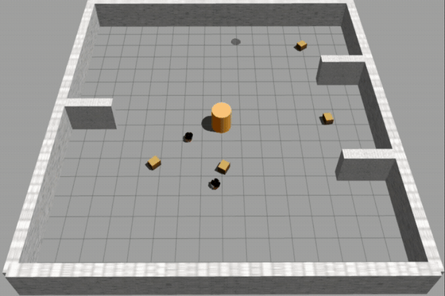

# Deep Reinforcement Learning–Based Safe Path Planning for Leader–Follower Robots

[](https://doi.org/10.1007/s11370-026-00745-y)
[](https://github.com/ehsankt7/leader-follower-mmatd3/actions/workflows/tests.yml)


Research code accompanying the paper **“Deep reinforcement learning–based safe path planning for leader–follower robots”**, published in *Intelligent Service Robotics* (2026).

**Ehsan Kazemi Tameh · Mohammadreza Estarki · Saeed Khodaygan**

This work investigates safe path planning for a leader–follower robotic system using multi-agent deep reinforcement learning. The proposed **M-MATD3** framework is developed under centralized training with decentralized execution, allowing both robots to generate continuous motion commands from their local observations while coordinating toward a common navigation objective.

The repository contains the learning algorithms, ROS/Gazebo simulation environments, experiment configurations, evaluation utilities, and demonstrations used for the study. Details of the formulation and algorithm are provided in the associated paper.

## Demonstrations

| Simple environment | Complex environment |
|---|---|
|  |  |

Full demonstrations: [`simple_demo.mp4`](media/simple_demo.mp4) · [`complex_demo.mp4`](media/complex_demo.mp4)

## Method Overview

The system consists of a leader robot navigating toward a goal and a follower robot that tracks the leader while avoiding obstacles and maintaining the formation.

Both agents use LiDAR-based observations and continuous linear and angular velocity commands. The proposed M-MATD3 method builds on multi-agent actor–critic reinforcement learning and modifies the actor-update mechanism of MATD3 by incorporating information from both critic networks.

The framework is evaluated in ROS-1/Gazebo using randomly generated obstacle configurations with different levels of environmental complexity.

For comprehensive details on the state and action definitions, reward formulation, networks architecture, algorithm derivation, and experimental setup, please refer to the paper.

## Results

The study compares **MADDPG**, **MATD3**, and the proposed **M-MATD3** in the simple environment.

| Method | ANRF | Collision rate (%) | Success rate (%) |
|---|---:|---:|---:|
| MADDPG | 9.83 | 17.23 | 80.71 |
| MATD3 | 12.32 | 23.90 | 74.57 |
| **M-MATD3** | **14.65** | **8.15** | **90.43** |

M-MATD3 was subsequently evaluated in a more complex environment, where it maintained strong navigation performance under more challenging obstacle configurations.

Additional analysis and experimental results are available in the paper.

## Repository Structure

```text
configs/                      experiment configurations
src/                          learning algorithms and simulation interfaces
scripts/                      training, evaluation, and plotting utilities
ros/catkin_ws/                ROS/Gazebo workspace and simulation assets
media/                        demonstration videos and previews
results/                      result-output location
tests/                        unit tests
docs/                         additional usage and reproduction information
```

## Installation

The experiments were developed using Python, PyTorch, ROS-1, and Gazebo.

```bash
git clone https://github.com/ehsankt7/leader-follower-mmatd3.git
cd leader-follower-mmatd3

python3 -m venv .venv
source .venv/bin/activate

python -m pip install --upgrade pip
pip install -e .[dev]
```

Build the ROS workspace:

```bash
cd ros/catkin_ws
catkin_make
source devel/setup.bash
cd ../../..
```

Run the tests with:

```bash
pytest -q
```

## Training

Train M-MATD3 in the simple environment:

```bash
python scripts/train.py \
  --config configs/simple_mmatd3.json \
  --output outputs/simple_mmatd3
```

Train in the complex environment:

```bash
python scripts/train.py \
  --config configs/complex_mmatd3.json \
  --output outputs/complex_mmatd3
```

Configurations for the MADDPG and MATD3 baselines are also provided in `configs/`.

## Evaluation

A trained model can be evaluated using:

```bash
python scripts/evaluate.py \
  --config configs/complex_mmatd3.json \
  --checkpoint <checkpoint-path> \
  --episodes 100
```

See [`docs/REPRODUCIBILITY.md`](docs/REPRODUCIBILITY.md) for additional commands.

## Paper

**Deep reinforcement learning–based safe path planning for leader-follower robots**  
Ehsan Kazemi Tameh, Mohammadreza Estarki, and Saeed Khodaygan  
*Intelligent Service Robotics*, 19:83, 2026

[**Read the paper**](https://doi.org/10.1007/s11370-026-00745-y)

## Citation

If you use this repository in your research, please cite:

```bibtex
@article{kazemitameh2026leaderfollower,
  title   = {Deep reinforcement learning-based safe path planning for leader-follower robots},
  author  = {Kazemi Tameh, Ehsan and Estarki, Mohammadreza and Khodaygan, Saeed},
  journal = {Intelligent Service Robotics},
  volume  = {19},
  year    = {2026},
  doi     = {10.1007/s11370-026-00745-y}
}
```

Citation metadata is also provided in [`CITATION.cff`](CITATION.cff).

