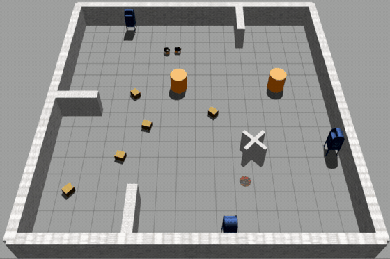

# Deep Reinforcement Learning–Based Safe Path Planning for Leader–Follower Robots

**Ehsan Kazemi Tameh · Mohammadreza Estarki · Saeed Khodaygan**

Project page for the paper published in *Intelligent Service Robotics* (2026).

[Read the paper](https://doi.org/10.1007/s11370-026-00745-y) · [Source code](https://github.com/ehsankt7/leader-follower-mmatd3)

## Demonstrations

| Simple environment | Complex environment |
|---|---|
|  |  |

The repository provides the implementation and simulation assets used for the study. For the formulation, algorithmic details, and quantitative analysis, please see the paper.
